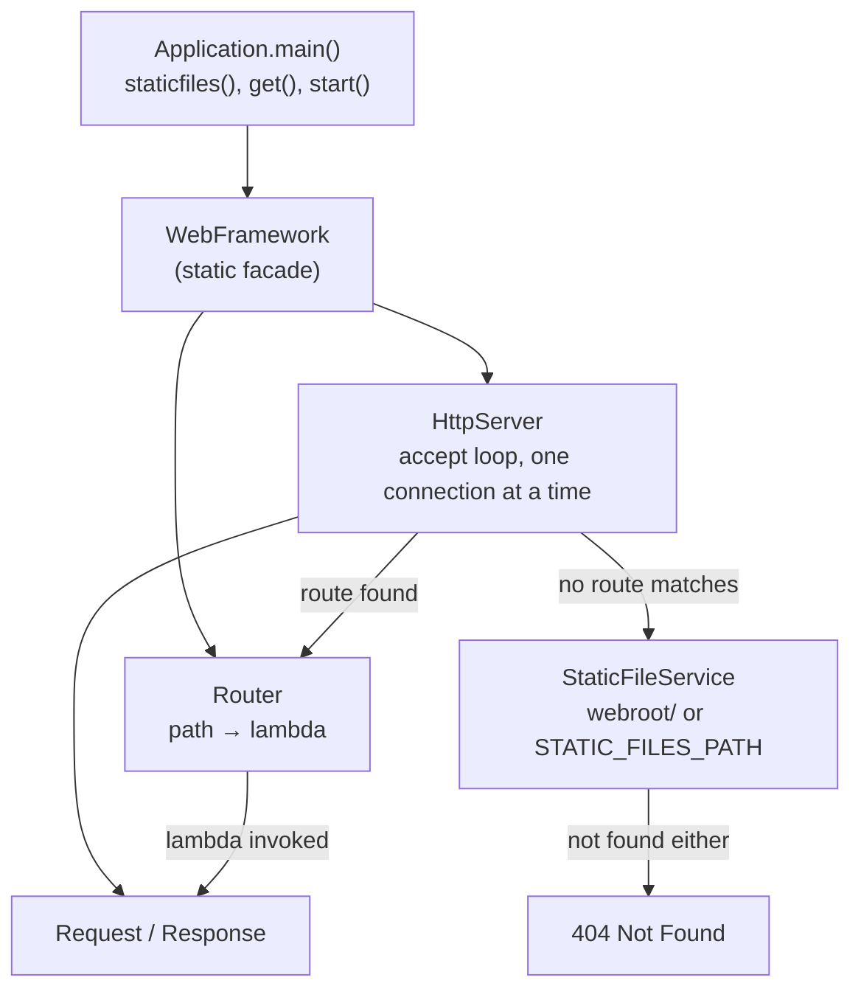

# Lab06 — Building and Deploying a Maintainable Application Server

A small, sequential Java **application server** — a lightweight web
framework — built directly on top of `java.net.ServerSocket`. It serves
static HTML/CSS/JS/images and lets an application register HTTP `GET`
endpoints through **lambda functions**, without ever touching the
server's connection loop. The same source code runs unmodified on a
developer machine and on a cloud instance.

## Table of contents

- [Project description](#project-description)
- [Architecture](#architecture)
- [Architecture metaphor](#architecture-metaphor)
- [Component responsibilities](#component-responsibilities)
- [Why this architecture is maintainable](#why-this-architecture-is-maintainable)
- [Project structure](#project-structure)
- [Prerequisites](#prerequisites)
- [Build and run locally](#build-and-run-locally)
- [Environment variables](#environment-variables)
- [Using the application](#using-the-application)
- [Tests performed](#tests-performed)
- [Graceful shutdown](#graceful-shutdown)
- [Cloud deployment (AWS)](#cloud-deployment-aws)
- [Public deployment URL](#public-deployment-url)
- [Evidence](#evidence)
- [Known limitations](#known-limitations)
- [Author](#author)

## Project description

This project evolves a static HTTP server into a small, reusable web
framework (`co.edu.escuelaing.webframework`) that any application
(`co.edu.escuelaing.app.Application`) can build on:

```java
staticfiles("/webroot");

get("/hello", (req, resp) -> "Hello " + req.getValue("name"));
get("/pi", (req, resp) -> String.valueOf(Math.PI));

start();
```

The server remains **sequential on purpose**: one `ServerSocket.accept()`
call is fully resolved — request parsed, handler invoked, response
written, socket closed — before the next connection is accepted. There
is no thread pool and no asynchronous server-side execution.

## Architecture

```
Application (co.edu.escuelaing.app)
    Registers routes, static folder, and reads env-based configuration
        ↓
WebFramework — get(), staticfiles(), start(), stop()
    The only class the application ever calls
        ↓
Router
    Maps "GET /path" → registered lambda (GetService)
        ↓
HttpServer
    Accepts one connection at a time, parses the request line,
    resolves it (dynamic route → static file → 404), writes one response
        ↓
Request / Response
    Method, path, query-string values / status + content type
        ↓
StaticFileService
    Serves classpath (or STATIC_FILES_PATH) resources when no route matches
```



Incoming request flow (as required by the lab):

```
Parse method, path, query string
        ↓
Look for a registered dynamic route (Router)
        ↓
  found → execute its lambda, write its return value as the body
        ↓
  not found → attempt StaticFileService.read(path)
        ↓
    found → serve the file bytes with the right Content-Type
        ↓
    not found → 404 Not Found
```

## Architecture metaphor

**The application server as an office building.**

| Building metaphor | Framework component |
|---|---|
| Building entrance and receptionist | `HttpServer` — accepts one visitor (TCP connection) at a time, reads their request slip, and never lets a second visitor in until the first one has been fully attended and shown out. |
| Directory in the lobby | `Router` — a lookup table from a path (`/hello`, `/pi`) to the office that handles it; consulting it never requires rebuilding the lobby. |
| Individual offices | `GetService` lambdas registered with `get(...)` — each one knows how to do exactly one thing (compute a greeting, return π) and nothing about how visitors got there. |
| Document archive | `StaticFileService` — a drawer of pre-printed pages (HTML/CSS/JS) and photos (images) handed out unchanged when no office claims the request. |
| Building configuration board | Environment variables (`PORT`, `APP_ENV`, `GREETING_PREFIX`, `STATIC_FILES_PATH`) — which door visitors use, which wing is open, what the receptionist says, and where the archive physically lives; none of it is painted onto the walls (hardcoded). |
| Closing procedure | Graceful shutdown (`/shutdown` → `stop()`) — the receptionist finishes handing the current visitor their answer, locks the front door so no one new walks in, and only then turns off the lights (`ServerSocket` closes). |

Adding a new dynamic endpoint is opening a new office and adding one
line to the lobby directory — the entrance, the accept loop, and every
other office are untouched.

## Component responsibilities

| Component | File | Responsibility |
|---|---|---|
| `WebFramework` | `webframework/WebFramework.java` | Public API: `staticfiles()`, `get()`, `start()`, `stop()`. The only class an application imports. |
| `HttpServer` | `webframework/HttpServer.java` | Owns the `ServerSocket` accept loop, parses the request line, dispatches to `Router` or `StaticFileService`, writes exactly one HTTP response, and implements the sequential graceful-shutdown protocol. |
| `Router` | `webframework/Router.java` | Stores `path → GetService` registrations and resolves a path to its handler. |
| `GetService` | `webframework/GetService.java` | Functional interface for a route lambda: `(Request, Response) → String`. |
| `Request` | `webframework/Request.java` | Read-only view of method, path and query-string values (`getValue(name)`). |
| `Response` | `webframework/Response.java` | Mutable status code / content type a handler can set before returning its body. |
| `StaticFileService` | `webframework/StaticFileService.java` | Resolves and reads static resources from the classpath (or `STATIC_FILES_PATH`), rejecting path-traversal attempts. |
| `ContentTypes` | `webframework/ContentTypes.java` | Maps a file extension to its MIME type. |
| `Application` | `app/Application.java` | The example application: registers `/hello`, `/pi`, `/date`, the dev-only `/shutdown`, and the static folder. |

## Why this architecture is maintainable

| Principle | Application in this project |
|---|---|
| Separation of concerns | `HttpServer` (transport) never contains application logic; `Application` never touches sockets. |
| Modularity | Routing (`Router`), request parsing (`Request`/`HttpServer`), and static files (`StaticFileService`) are independent classes. |
| Low coupling | Registering `get("/date", ...)` in `Application` requires zero changes to `HttpServer` or `Router`'s internals. |
| High cohesion | Each class has one job: `ContentTypes` only maps extensions, `StaticFileService` only reads files safely. |
| Abstraction | The application developer calls `get()`/`staticfiles()`/`start()` and never sees a `Socket`. |
| Externalized configuration | `PORT`, `APP_ENV`, `GREETING_PREFIX`, `STATIC_FILES_PATH` all come from `System.getenv()`, not from source code. |
| Extensibility | A new service is one `get(path, lambda)` call away — see [`Application.java`](src/main/java/co/edu/escuelaing/app/Application.java). |
| Testability | `Router`, `Request` and `StaticFileService` are unit-tested with plain JUnit, with no socket involved (see [`src/test`](src/test/java/co/edu/escuelaing/webframework)). |
| Operational maintainability | The exact same jar runs with `java -jar lab06-webframework.jar` locally and on the EC2 instance — only environment variables change. |

## Project structure

```
.
├── pom.xml
├── deploy/
│   └── lab06-webframework.service        # sample systemd unit for EC2
├── src/
│   ├── main/
│   │   ├── java/co/edu/escuelaing/
│   │   │   ├── webframework/
│   │   │   │   ├── WebFramework.java      # get(), staticfiles(), start(), stop()
│   │   │   │   ├── HttpServer.java        # accept loop + graceful shutdown
│   │   │   │   ├── Router.java
│   │   │   │   ├── GetService.java        # lambda functional interface
│   │   │   │   ├── Request.java
│   │   │   │   ├── Response.java
│   │   │   │   ├── StaticFileService.java
│   │   │   │   └── ContentTypes.java
│   │   │   └── app/
│   │   │       └── Application.java       # example application
│   │   └── resources/webroot/             # everything the browser can fetch
│   │       ├── index.html
│   │       ├── app.js
│   │       ├── styles.css
│   │       └── images/logo.png
│   └── test/java/co/edu/escuelaing/webframework/
│       ├── RouterTest.java
│       ├── RequestTest.java
│       └── StaticFileServiceTest.java
└── README.md
```

## Prerequisites

- **Java 17+** (the build targets `--release 17`).
- **Maven 3.9+**.
- A browser, and `curl`/PowerShell's `Invoke-WebRequest` for the
  protocol-level checks below.

## Build and run locally

```bash
mvn clean package
```

This compiles the framework and the example application, runs the unit
tests, and produces a single runnable jar at
`target/lab06-webframework.jar` with `webroot/` bundled on its
classpath.

```bash
# Default port 8080, development mode (enables /shutdown):
java -jar target/lab06-webframework.jar

# Or choose a port / environment explicitly:
PORT=9000 APP_ENV=development GREETING_PREFIX=Hola java -jar target/lab06-webframework.jar
```

Then open **http://localhost:8080/** in a browser.

You can also run it directly with Maven while developing:

```bash
mvn exec:java
```

## Environment variables

| Variable | Purpose | Local default |
|---|---|---|
| `PORT` | HTTP server port | `8080` |
| `GREETING_PREFIX` | Prefix used by the `/hello` route | `Hello` |
| `APP_ENV` | Execution environment; `/shutdown` is only registered when this equals `development` | `development` |
| `STATIC_FILES_PATH` | Optional external filesystem folder for static resources, overriding the classpath `webroot/` | not set (uses the bundled classpath folder) |

None of these are secrets; no credentials or API keys are used or
committed anywhere in this repository.

## Using the application

| Request | Expected result |
|---|---|
| `GET /hello?name=Pedro` | `200`, dynamic response from a lambda: `Hello Pedro` |
| `GET /hello?name=Pedro&language=en` | `200`, extra query params are accepted and ignored if unused |
| `GET /hello` (no `name`) | `200`, falls back to `Hello world` — a missing parameter never fails the request |
| `GET /pi` | `200`, dynamic response: the value of `Math.PI` |
| `GET /date` | `200`, current server date/time |
| `GET /index.html` | `200`, static HTML |
| `GET /app.js` | `200`, static JavaScript |
| `GET /images/logo.png` | `200`, static binary image |
| `GET /unknown` | `404 Not Found` |
| `GET /shutdown` (only when `APP_ENV=development`) | `200`, then the server finishes shutting down |

The home page (`index.html` + `app.js`) uses asynchronous `fetch()`
calls against `/hello`, `/pi` and `/date` to update the page without a
reload.

## Tests performed

Automated (`mvn test`, JUnit 5 — no sockets involved):

- `RouterTest` — a registered route resolves to its lambda; an
  unregistered path resolves to `null`.
- `RequestTest` — `getValue()` returns a present query parameter and
  returns `null` (not an exception) for a missing one.
- `StaticFileServiceTest` — reads an existing resource, defaults `/` to
  `index.html`, returns `null` for a missing resource, rejects a
  `../` path-traversal attempt, and resolves content types by
  extension.

```
Tests run: 9, Failures: 0, Errors: 0, Skipped: 0
```

Manual protocol-level verification (jar running locally on port 8080,
`APP_ENV=development`, `GREETING_PREFIX=Hola`):

```
GET /hello?name=Pedro                 → 200  "Hola Pedro"
GET /hello?name=Pedro&language=en     → 200  "Hola Pedro"
GET /hello                            → 200  "Hola world"
GET /pi                               → 200  "3.141592653589793"
GET /index.html                       → 200  text/html; charset=UTF-8
GET /app.js                           → 200  application/javascript; charset=UTF-8
GET /images/logo.png                  → 200  image/png (6823 bytes)
GET /unknown                          → 404  Not Found
```

All eight calls above were exercised against the packaged jar during
development of this lab and returned exactly the values shown.

## Graceful shutdown

With `APP_ENV=development` (the local default), `/shutdown` is
registered:

```
GET /shutdown → 200 "Server will stop after this response."
```

Server log after that call:

```
Server listening on port 8080
Server stopped gracefully.
```

A subsequent request to the same port fails to connect — the listening
socket is gone (verified locally: no process left listening on the
port after the call, and the accept loop exits only *after* the
`/shutdown` response was already written and the client socket closed,
per the required sequence).

With `APP_ENV=production`, the same request returns `404 Not Found`
instead — `/shutdown` is never registered, so it is indistinguishable
from any other unknown route. This is what must be verified again
against the deployed cloud instance (see [Evidence](#evidence)).

## Cloud deployment (AWS)

This section is the step-by-step procedure to run **outside** VS Code,
directly in the AWS console / a terminal connected to the instance.
Steps 1–2 are already done locally; everything from step 3 onward
happens in AWS.

1. **Package the application** (already verified locally):
   ```bash
   mvn clean package
   ```
   This produces `target/lab06-webframework.jar` — the only artifact
   you need to copy to the cloud instance (static resources are bundled
   inside it).

2. **Sanity-check the jar once more locally** with `APP_ENV=production`
   to confirm `/shutdown` is disabled before you ever expose the port
   publicly (see [Graceful shutdown](#graceful-shutdown)).

3. **Launch (or reuse) an EC2 instance** from the AWS/AWS Academy
   console: pick an approved Linux AMI (Amazon Linux 2023 is a good
   default), the smallest approved instance type, default VPC/public
   subnet.

4. **Configure the security group**:
   - Inbound SSH (port 22) restricted to your current IP only.
   - Inbound custom TCP rule for the application port (e.g. `8080`)
     from the range your instructor allows (`0.0.0.0/0` if the app
     must be publicly reachable, or a narrower range if not).

5. **Connect to the instance** (SSH, EC2 Instance Connect, or Session
   Manager — whichever your course approves).

6. **Install a Java 17+ runtime** on the instance, e.g. on Amazon
   Linux:
   ```bash
   sudo dnf install -y java-17-amazon-corretto
   ```

7. **Create the application directory**:
   ```bash
   sudo mkdir -p /opt/lab06/logs
   sudo chown ec2-user:ec2-user /opt/lab06 /opt/lab06/logs
   ```

8. **Transfer the jar** from your machine to the instance, e.g.:
   ```bash
   scp -i <your-key>.pem target/lab06-webframework.jar ec2-user@<instance-public-ip>:/opt/lab06/
   ```
   (If you only have browser-based EC2 Instance Connect and no key
   handy, generate a throwaway SSH key locally, append its public half
   to `~/.ssh/authorized_keys` from the already-open browser terminal,
   then `scp` in using that key.)

9. **Run it as a managed service** so it survives logout and restarts
   on failure. Copy
   [`deploy/lab06-webframework.service`](deploy/lab06-webframework.service)
   to the instance, adjust `WorkingDirectory`/`User`/`PORT` if needed
   — **make sure `APP_ENV=production` is set**, since that is what
   disables `/shutdown` publicly — then:
   ```bash
   sudo cp lab06-webframework.service /etc/systemd/system/
   sudo systemctl daemon-reload
   sudo systemctl enable --now lab06-webframework
   sudo systemctl status lab06-webframework
   journalctl -u lab06-webframework -f
   ```

10. **Verify locally on the instance first**:
    ```bash
    curl -i http://localhost:8080/hello?name=Cloud
    curl -i http://localhost:8080/shutdown   # must be 404 in production
    ```

11. **Verify remotely** by opening
    `http://<instance-public-ip>:8080/` from your own machine (not the
    instance) and repeating the test matrix from
    [Using the application](#using-the-application) — this is what
    actually proves the security group and public networking path
    work, not just that the JVM process runs. Capture the screenshots
    listed in [Evidence](#evidence) at this point.

12. **Stop cleanly** with `sudo systemctl stop lab06-webframework` when
    you are done testing.

### Alternative: container-based deployment

A `Dockerfile` is not included by default since the plain-jar/EC2 path
above is sufficient for this lab, but the same jar can be containerized
if you prefer a container-based deployment (e.g. to AWS App Runner or
ECS):

```dockerfile
FROM eclipse-temurin:17-jre
WORKDIR /app
COPY target/lab06-webframework.jar app.jar
ENV PORT=8080
ENV APP_ENV=production
EXPOSE 8080
ENTRYPOINT ["java", "-jar", "app.jar"]
```

## Public deployment URL

`http://34.230.35.33:8080/`

This EC2 instance does not have an Elastic IP attached, so this address
was only guaranteed to be live for the duration of the deployment
window captured in [Evidence](#evidence) below. Once the instance is
stopped or terminated, this address stops resolving — the screenshots
below are the record of it having worked.

### Example URLs

Static resources:

- `http://34.230.35.33:8080/` (→ `index.html`)
- `http://34.230.35.33:8080/app.js`
- `http://34.230.35.33:8080/styles.css`
- `http://34.230.35.33:8080/images/logo.png`

REST endpoints:

- `http://34.230.35.33:8080/hello?name=Cloud`
- `http://34.230.35.33:8080/pi`
- `http://34.230.35.33:8080/date`

The same paths work against `http://localhost:8080/...` when running
the jar locally.

## Evidence

All screenshots below were captured against the actual EC2 instance at
`34.230.35.33:8080` (Amazon Linux 2023, `t3.micro`), following the
[Cloud deployment](#cloud-deployment-aws) procedure step by step.

### Deployment process

| Step | Evidence |
|---|---|
| 6 — Java 17 runtime installed on the instance |  |
| 5 — SSH connection established from the local machine |  |
| 8 — Jar transferred via `scp` |  |
| 8 — Jar confirmed present on the instance |  |
| 9 — systemd service installed and active |  |
| 10 — Verified locally on the instance (`curl localhost:8080`) |  |
| Bug fix mid-deployment: the root path (`/`) was initially served with `Content-Type: application/octet-stream`, so browsers downloaded `index.html` instead of rendering it. Fixed in `StaticFileService`/`HttpServer` to compute the content type from the *resolved* file name (`index.html`), not the raw `/` request path — then the jar was rebuilt, re-uploaded, and the service restarted. |  |

### Required functional evidence

**Home page served from the public EC2 address** (`GET /`):


**Static resource served from the cloud** (`GET /images/logo.png`):


**At least two REST endpoint responses** (`GET /hello?name=Cloud`, `GET /pi`):


**Configured environment variables, without exposing secrets** (`systemctl show lab06-webframework -p Environment`):


**`/shutdown` working locally in development.** No separate screenshot was
captured for this one; the manual verification below was run directly
against the packaged jar on the developer machine during this lab
(`APP_ENV=development`, default `PORT=8080`):

```
$ curl -i http://localhost:8080/shutdown
HTTP/1.1 200 OK
...
Server will stop after this response.

# server log:
Server listening on port 8080
Server stopped gracefully.

$ curl -i http://localhost:8080/pi
curl: (7) Failed to connect to localhost port 8080: Connection refused
```

**`/shutdown` blocked in the public production deployment** (`APP_ENV=production` → `404 Not Found`):


### Cleanup

**Instance stopped** (`sudo systemctl stop lab06-webframework`, then EC2 → Stop instance):


## Known limitations

- The server handles **one TCP connection at a time** — no thread
  pool, no concurrency, by design (this lab's explicit scope).
- Only **`GET`** is implemented; any other method returns
  `405 Method Not Allowed` before routing is even attempted.
- Routing is exact-path matching only — no path parameters or
  wildcards.
- No persistence, authentication, TLS, or other production hardening;
  this is a teaching baseline for a maintainable *structure*, not a
  production-grade server.

## Author

Author: Joshua (student, TDSE course).
